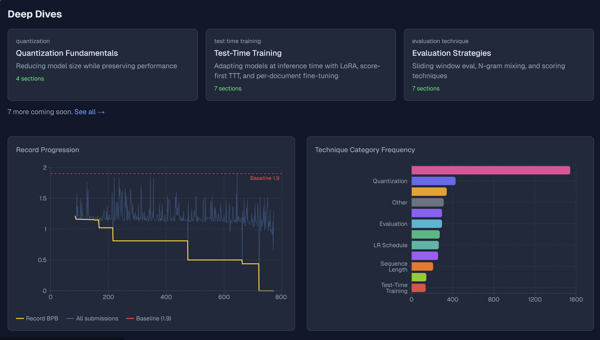

# Parameter Golf Field Guide

An interactive learning site that breaks down every technique used in OpenAI's [Parameter Golf](https://github.com/openai/parameter-golf) competition — from quantization and architecture tricks to test-time training — with interactive deep dives, real submission data, and code.

**Live site:** [sameersegal.github.io/learn-parameter-golf](https://sameersegal.github.io/learn-parameter-golf/)



## What's Inside

- **Deep Dives** — Interactive tutorials on quantization, test-time training, evaluation strategies, and more, with JS animations and real code
- **Technique Explorer** — Browse 400+ technique variants across 12 categories, with hyperparameter tables and BPB stats
- **PR Pages** — Detailed breakdowns of every competition submission
- **Record Progression** — Charts showing how BPB records have fallen over time
- **Auto-updating** — GitHub Actions scrapes new PRs every 3 hours, parses them with GPT, and redeploys

## Architecture

```
GitHub API (openai/parameter-golf)
    |
scrape.py --> data/raw/*.json          Raw PR metadata + README
    |
parse.py  --> data/parsed/*.json       Structured extraction via gpt-5.4-mini
    |
    +-> scripts/bundle-data.js         Aggregates into submissions.json + technique-index.json
    |
    +-> web/ (Next.js)                 Static site deployed to GitHub Pages
    |     /                            Landing page with stats, deep dives, charts
    |     /learn/[slug]                Interactive deep dive tutorials
    |     /techniques/[cat]/[method]   Technique detail pages
    |     /pr/[id]                     Submission detail pages
    |     /prs                         Full sortable leaderboard
    |     /emerging                    Unmapped/new techniques
    |
    +-> agent.py                       Interactive Q&A REPL over parsed data
```

## Quick Start

```bash
# Python setup
python -m venv .venv
source .venv/bin/activate   # Windows: .venv\Scripts\activate
pip install -r requirements.txt

# Scrape PRs from GitHub (incremental)
python scrape.py --limit 50

# Parse raw PRs into structured JSON (incremental)
python parse.py -v

# Run the web site locally
cd web && npm install
LOCAL_DEV=1 npx next build && npx serve out -l 3000
# Open http://localhost:3000

# Interactive Q&A agent
python agent.py
```

## Environment Variables

| Variable | Required for | Description |
|----------|-------------|-------------|
| `GITHUB_TOKEN` | scrape.py | GitHub API authentication |
| `OPENAI_API_KEY` | parse.py, agent.py | OpenAI API key |

## CI/CD

The [GitHub Actions workflow](.github/workflows/update-and-deploy.yml) runs every 3 hours:

1. Scrapes new PRs from `openai/parameter-golf`
2. Parses new submissions with GPT (skips already-parsed)
3. Bundles data and builds the Next.js static site
4. Commits updated data back to `main`
5. Deploys to GitHub Pages (`gh-pages` branch)

## License

MIT
